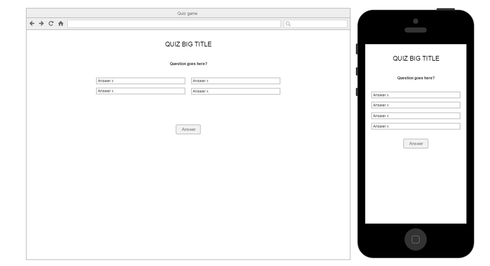

#Web Developer Test
##Questions
###General Knowledge:
Q. Describe a RESTful service.

A. A web service that uses HTTP protocol to allow the client and server to talk to each other. When building or fetching an API, you would use REST API to fetch the data you want.
An example would be the GET, POST, PUT and DELETE. Let's say you build a form on a web page. You want to collect the 
information the user enters by using either a GET or POST method.  A POST method would allow the user to submit the data rather than overwriting like a POST.

Q. Describe MVC and MVVM.

A. MVC (Model View Controller) focuses on three components: model, view and controller. It is an architectual pattern that focuses on the interface of a computer, the way data is displayed, and the flow of the application

MVVM (Model View - View Model) focuses on the interface and it's logic and used on mainly XAML platforms. It is also an
architectual pattern that is used to focus on the characteristics of a model and set of classes, UI componenents displaying data, and the methods and functions to operate the model.

Q. Describe an SPA application.

A. Single-page Application is a basically a one pge web application that does not require the reloading time during use. An example would be building a Google Maps on a web page and using JavaScript to call out the functions. In JQuery, you would write a onload function, call out the locations with longitude and Latitude coordiantes, zoom, etc, make sure to add the Google Map API first. 


Q. What is a microservice?

A. An architectual style that structures an application focusing on services like whether or not the application is maintainable or testable. 

Q. What is Node.js?

A. A platform for JavaScript that is used to code outside of the web browser. It is used to build faster and more scalable application. It uses non-blocking event driven I/O to give lightweight and data intensive real-time applications.

Q. What is the package.json file? What is it used for?

A. This is a project root file that holds most of the data, metadata and is used to give npm information to allow it to identify the project's dependencies. It is the file core of Node.js ecosystem.


Q. What are the differences between two-way data binding and one-way data binding? Which common JavaScript frameworks showcase them.

One way binding is the process of an ongoing connection between the model and the UI, while two-way binding is referred to changes of the values of the variables and keeps track of the changes made in the system. React would be one-way binding and Angular would be two-way binding. 

###Vue.js
Q. What is Vue.js?

A. Is a type of JavaScript framework that focuses on the MVVM pattern. It is used to build single-page web applications and the UI of it. 

Q. What are components? 

A. 

Q. What are component Props?

Q. What are the differences between ```v-bind``` and ```v-model```. Show an example.

Q. What is Vuex? What problems does it try to solve?
###JavaScript
Q. What is the difference between ```const```, ```let```, and ```var```

Q. Explain the ```async``` and ```await``` keywords.

Q. Explain deconstruction.

Q. Explain the ```...``` operator.

Q. Explain the `!!` operator.

Q. Write a function to remove duplicate items from an array of strings.

Q. What is the output of the following, and explain the differences.
```javascript
console.log(false == 0);
console.log(false === 0);
```
Q. What is the output of the following, and explain why.
```javascript
console.log(null || 1 || undefined);
```

Q. What is the output of the following, and explain why.
```javascript
let object1 = { elem: 1 };
let object2 = { elem: 1 };
let object3 = object1;

console.log(object1 === object2);
console.log(object1 === object3); 
```
Q. Explain the arrow function `=>`. What are some differences between an arrow function and a regular function.
```javascript
const x = ['item'];
x.forEach(elem => console.log(elem));
```

Q. What is a closure?

Q. Given the following
```javascript
function wait(label) {
  return new Promise(resolve => {
    setTimeout(resolve(label), 1000);
  });
}

async function(){
  const list = [wait(“First”), wait(“Second”)];
  console.log(“Started function”);
  list.foreach(function(x){
    console.log(“Started”);
    console.log(await x);
    console.log(“Finished”);
  });
  console.log(“Finished function”);
}
````
We want the output to look like

1. Started function
2. Started
3. First
4. Finished
5. Started
6. Second
7. Finished
8. Finished Function

What is the output and how would you fix the function to operate in the assumed manner?
##Quiz video game
###Description
- You have to make a quiz web app using the json data provided.
###Requirements
- The player can see one question at the time
- The player can see a score at the end
- The player should not see the same order of questions next time the quiz is taken
- You cannot edit the quizQuestions.txt file
- The game should be a Single Page Application
- The game should be responsive and can be played on mobile devices
- Use the assets provided, make your own, or use CSS
- Use a Google Web Font (https://www.google.com/fonts) of your choice
- You can use Bootstrap, MaterializeCSS or no framework as desired
###Extra Credit
- Add an intro screen with a PLAY button
- Add a PLAY AGAIN button if the player has already played the game 
- Add animations for correct and incorrect answers by the player using CSS3
- Add play again functionality
Example Quiz Layout


